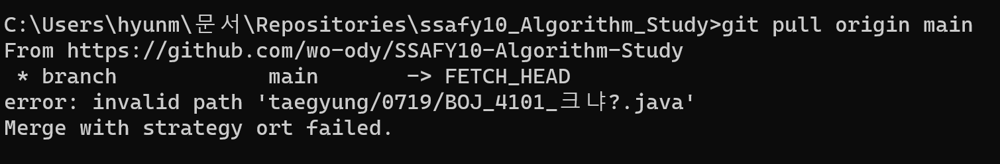

# ⌨️ SSAFY 10기 알고리즘스터디 <가 요 플래>

<table>
  <tr>
    <td>진행 기간</td>
    <td>2023년 7월 20일 ~ ing </td>
  </tr>
  <tr>
    <td>스터디 장소</td>
    <td>🔊 Discord</td>
  </tr>
  <tr>
    <td>정기 스터디 시간</td>
    <td>매주 수요일 &rarr; <a href="/study_discord/"><b>일정 확인</b></a></td>
  </tr>
  <tr>
    <td>플랫폼</td>
    <td><a href="https://www.acmicpc.net/">Baekjoon</a></td>
  </tr>
  <tr>
    <td>언어</td>
    <td>
      JAVA
      <!--   -->
      <!--  -->
    </td>
  </tr>
</table>

 

## 💻️ 스터디 멤버

<table align="center">
 <tr>
    <td align="center"></td>
    <td align="center"></td>
    <td align="center"></td>
    <td align="center"></td>
  </tr>
  <tr>
    <td align="center"><a href="https://github.com/jaewonwi"><b>jaewonwi</b></a></td>
    <td align="center"><a href="https://github.com/hyunmin2667"><b>hyunmin2667</b></a></td>
    <td align="center"><a href="https://github.com/Grat3Su"><b>Grat3Su</b></a></td>
    <td align="center"><a href="https://github.com/crcho5133"><b>crcho5133</b></a></td>
  </tr>
  <!-- <tr> 
    <td align="center"></td>
    <td align="center"></td>
    <td align="center"></td>
    <td align="center"></td>
    <td align="center"> </td>
  </tr>  -->
</table>

 

## 📌 스터디 규칙

### 1. 평일 1문제
- 주말은 쉽니다.
- **백준 실버 1문제** 이상 깃허브에 업로드
- **새벽 4시전**까지 제출
- 벌금 10회마다 **벌금 증가(1000원씩)**

 |    이름     | 벌금횟수 | 벌금합계 |
 |:-----------:|:--------:|:--------:|
 |  jaewonwi   |    1     |  1000원  |
 | hyunmin2667 |    1     |  1000원  |
 |   Grat3Su   |    1     |   1000원    |
 |  crcho5133  |    0     |   0원    |

| 제출 | 미제출 | 벌금납부 | 쉬는날 | 자체코테 | 면제 | 
|:-----:|:-----:|:-------:|:-------:|:--------:|:-------:|
| ✅   | ❌     | ⭕       | ✈️     | 💻     | ✨  |

11월 진행상황 (펼치기/접기)

|  날짜  |  jaewonwi   |  hyunmin2667  |  Grat3Su  |  crcho5133  |  
|:-----:|:--------:|:-----------:|:-------:|:---------:|
|  11/10 (금)  |  ❌  |  ✅  |  ✅  |  ✅  |  
|  11/9 (목)  |  ✅  |  ✅  |  ✅  |  ❌  |  
|  11/8 (수)  |  ✅  |  ✅  |  ✅  |  ✅  |  
|  11/7 (화)  |  💻  |  💻  |  💻  |  💻  |  
|  11/6 (월)  |  ✅  |  ✅  |  ⭕  |  ❌  |  
|  11/3 (금)  |  ✅  |  ✅  |  ✅  |  ✅  |  
|  11/2 (목)  |  💻  |  💻  |  💻  |  💻  |  
|  11/1 (수)  |  ✅  |  ✅  |  ✅  |  ✅  |  

10월 진행상황 (펼치기/접기)

|  날짜  |  hyunmin2667  |  Grat3Su  |  crcho5133  |  jaewonwi   |  
|:-----:|:--------:|:-----------:|:-------:|:---------:|
|  10/31 (화)  |  ✅  |  ✅  |  ✅  |  ✅  |  
|  10/30 (월)  |  ✅  |  ✅  |  ✅  |  ✅  |  
|  10/27 (금)  |  ⭕  |  ✨  |  ✅  |  ⭕  |  
|  10/26 (목)  |  💻  |  💻  |  💻  |  💻  |  
|  10/25 (수)  |  ✅  |  ✅  |  ✅  |  ✅  |  
|  10/24 (화)  |  ✅  |  ✅  |  ✅  |  ✅  |  
|  10/23 (월)  |  ✅  |  ⭕  |  ✅  |  ✅  |  
|  10/20 (금)  |  ✅  |  ✅  |  ✅  |  ✅  |  
|  10/19 (목)  |  ✅  |  ✅  |  ✅  |  ✅  |  
|  10/18 (수)  |  ✅  |  ✅  |  ✅  |  ✅  |  

### 2. 매주 수요일 자체 코테
- **백준 그룹에서 진행**

<!-- - 📘Do it! 알고리즘 코딩 테스트 (백준 100문제)
- 30일 완성 커리큘럼을 60일로 진행(예정) -->

 

## 🔍 참여 방법

1. 생성된 원격 저장소에 `본인이름`으로 폴더를 생성한다.
2. 알고리즘 풀이 후 원격 저장소 자신의 폴더에 풀이한 소스 코드를 `push` 한다.
3. commit할 때 `commit 컨벤션`을 지킨다.
4. (option) 다른 사람들의 코드를 보고 자유롭게 코드리뷰를 한다.

 

<!-- ## 🧑🏻‍💻 진행 상황

| 
진행 상황  
          | 
표기</cetner>  |
|:-----------------|:----:|
| 해당 주에 완료 시       | ✅   |
| 해당 주에 미완료 시      | ❌   |

|   번호    |      날짜       | jaewonwi | hyunmin2667 | Grat3Su | crcho5133 | 
|:-------:|:-------------:|:-------:|:---------:|:--------:|:------------:|
| 1 | 7/20 |    ✅    |     ✅     |    ✅     |      ✅      |
| 2 | 7/21 |        |          |         |            |

 

 -->

<!-- ## 🧑🏻‍💻 스터디 계획표

펼치기/접기

|차수 |      날짜       | 분류 | 백준문제 |  진행도
|:---:|:-------------:|:-------:|:---------:|:---------:|
1일차	|	7/19	|	준비	|	코딩테스트	|	✅
2일차	|	7/20	|	준비	|	준비하기	|	✅
3일차	|	7/21	|	자료구조	|	배열의 리스트	|	✅
4일차	|	7/22	|	자료구조	|	구간 합	|	✅
5일차	|	7/23	|	자료구조	|	투 포인터	|	
6일차	|	7/24	|	자료구조	|	슬라이딩 윈도우	|	
7일차	|	7/25	|	자료구조	|	스택과 큐	|	
8일차	|	7/26	|	자료구조	|	스택과 큐	|	
9일차	|	7/27	|	정렬	|	버블 정렬	|	
10일차	|	7/28	|	정렬	|	선택 정렬	|	
11일차	|	7/29	|	정렬	|	삽입 정렬	|	
12일차	|	7/30	|	정렬	|	퀵 정렬	|	
13일차	|	7/31	|	정렬	|	병합 정렬	|	
14일차	|	8/1	|	정렬	|	기수 정렬	|	
15일차	|	8/2	|	탐색	|	깊이 우선 탐색	|	
16일차	|	8/3	|	탐색	|	너비 우선 탐색	|	
17일차	|	8/4	|	탐색	|	이진 탐색	|	
18일차	|	8/5	|	탐색	|	이진 탐색	|	
19일차	|	8/6	|	그리디	|	문제 풀이	|	
20일차	|	8/7	|	그리디	|	문제 풀이	|	
21일차	|	8/8	|	그리디	|	문제 풀이	|	
22일차	|	8/9	|	그리디	|	문제풀이	|	
23일차	|	8/10	|	정수론	|	소수 구하기	|	
24일차	|	8/11	|	정수론	|	오일러 피	|	
25일차	|	8/12	|	정수론	|	유클리드 호제법	|	
26일차	|	8/13	|	정수론	|	확장 유클리드 호제법	|	
27일차	|	8/14	|	그래프	|	그래프의 표현	|	
28일차	|	8/15	|	그래프	|	그래프의 표현	|	
29일차	|	8/16	|	그래프	|	유니온 파인드	|	
30일차	|	8/17	|	그래프	|	유니온 파인드	|	
31일차	|	8/18	|	그래프	|	위상 정렬	|	
32일차	|	8/19	|	그래프	|	위상 정렬	|	
33일차	|	8/20	|	그래프	|	다익스트라	|	
34일차	|	8/21	|	그래프	|	다익스트라	|	
35일차	|	8/22	|	그래프	|	벨만-포드	|	
36일차	|	8/23	|	그래프	|	플로이드-워셜	|	
37일차	|	8/24	|	그래프	|	최소 신장 트리	|	
38일차	|	8/25	|	그래프	|	최소 신장 트리	|	
39일차	|	8/26	|	트리	|	트리 알아보기	|	
40일차	|	8/27	|	트리	|	트라이	|	
41일차	|	8/28	|	트리	|	이진 트리	|	
42일차	|	8/29	|	트리	|	이진 트리	|	
43일차	|	8/30	|	트리	|	세그먼트 트리	|	
44일차	|	8/31	|	트리	|	세그먼트 트리	|	
45일차	|	9/1	|	트리	|	최소 공통 조상	|	
46일차	|	9/2	|	트리	|	최소 공통 조상	|	
47일차	|	9/3	|	조합	|	문제 풀이	|	
48일차	|	9/4	|	조합	|	문제 풀이	|	
49일차	|	9/5	|	조합	|	문제 풀이	|	
50일차	|	9/6	|	조합	|	문제 풀이	|	
51일차	|	9/7	|	동적 계획법	|	문제 풀이	|	
52일차	|	9/8	|	동적 계획법	|	문제 풀이	|	
53일차	|	9/9	|	동적 계획법	|	문제 풀이	|	
54일차	|	9/10	|	동적 계획법	|	문제 풀이	|	
55일차	|	9/11	|	동적 계획법	|	문제 풀이	|	
56일차	|	9/12	|	동적 계획법	|	문제 풀이	|	
57일차	|	9/13	|	동적 계획법	|	문제 풀이	|	
58일차	|	9/14	|	동적 계획법	|	문제 풀이	|	
59일차	|	9/15	|	기하	|	문제 풀이	|	
60일차	|	9/16	|	기하	|	문제 풀이	|	

  -->

## 📁 Repository 폴더 구조

- Github ID/날짜(월)/날짜(일)/소스코드(플랫폼, 문제 번호와 제목 명시)

  #### 💡 예시 : `jaewonwi/2023-07/0720/BOJ_1000_A+B.java`

 

## 📝 commit 컨벤션

- 백준_번호_문제이름

  #### 💡 예시 : `BOJ_1000_A+B`

 

## ☝️ 일부 폴더만 pull/push 하는 방법
1. 로컬에 프로젝트 폴더 하나 생성
2. > git init
3. > git remote add origin https://github.com/hyunmin2667/ssafy10-algorithm-study-to-gold.git
4. > `(일부폴더만 pull/push할 때)` git sparse-checkout init
5. > `(일부폴더만 pull/push할 때)` git sparse-checkout set `hyeonmin` << 자기 이름 폴더로 변경하면 됨
6. > `(일부폴더만 pull/push할 때:폴더 2개)` git sparse-checkout set `hyeonmin study_discord` 
7. > `(일부폴더만 pull/push할 때)` git sparse-checkout list << set 목록을 확인할 수 있는 명령어
8. > git pull origin main

9. 로컬에 생성되었는지 확인
10. .gitignore 생성하기
11. 제외항목
> 1. /public
> 2. /README.md
> 3. /.gitignore

12. commit/push 진행
> 1. git add `( '.' or add file)`
> 2. git commit -m "`(commit message)`"
> 3. git pull origin main
> 4. git push origin main

 

## ⚠️ invalid path error 발생했을 때 해결방법
- pull 중에 error가 발생했다.

- 검색해보니 windows 환경 git에서는 ?와 같은 특수문자가 포함되어 있으면 정상적으로 작동이 되지 않는다고 한다.

- 해결방법은 간단하다. 다음 코드를 순서대로 실행시키면 된다.
1. > git config core.protectNTFS false
2. > git checkout -f HEAD
